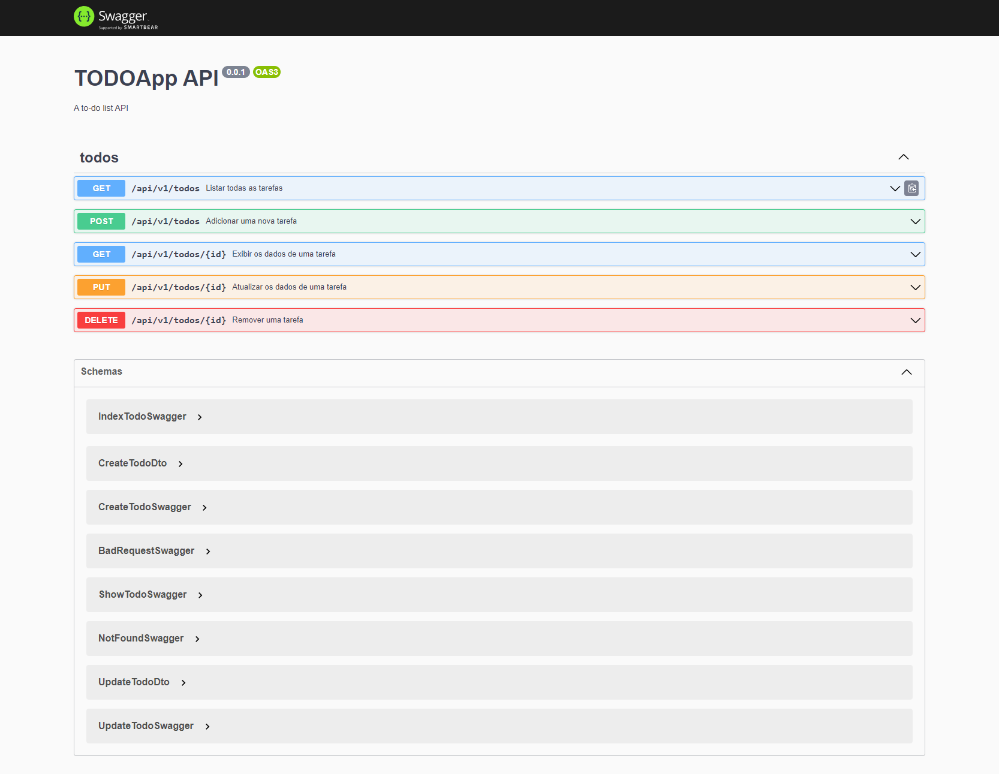

<p align="center">
  <a href="http://nestjs.com/" target="blank"></a>
</p>

## TODOApp - API

### Preview

After running the command `npm run start:dev` you can access the documentation at `http://localhost:3333/swagger`.



## Requirements

You will need a server with a running database to be able to use the API, the easiest way to create this server is using docker. Next you will have a tutorial on how to install docker and how to create a container with mariadb. Remember that the database information must be placed in an `.env` file to be used by the `app.module.ts` file.

### Tutorials

- [Installing Docker](https://docs.docker.com/desktop/install/windows-install/)
- [Installing and Using MariaDB via Docker](https://mariadb.com/kb/en/installing-and-using-mariadb-via-docker/)

## Installation

```bash
npm install
```

## Running the app

```bash
# development
$ npm run start

# watch mode
$ npm run start:dev

# production mode
$ npm run start:prod
```

## Test

```bash
# unit tests
$ npm run test

# e2e tests
$ npm run test:e2e

# test coverage
$ npm run test:cov
```
